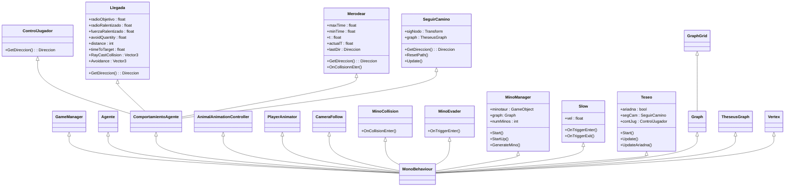

# Minotaur - Base
Proyecto de videojuego actualizado a **Unity 2022.3.40f1**, diseñado para servir como punto de partida en algunas prácticas de desarrollo de videojuegos.

Consiste en un entorno virtual 3D que representa el legendario Laberinto del Minotauro, generado a partir de una descripción en forma de fichero de texto, con un personaje controlable por el jugador que es Teseo y uno o varios minotauros que actúan como enemigos.

## Licencia
Federico Peinado, autor de la documentación, código y recursos de este trabajo, concedo permiso permanente a los alumnos de la Facultad de Informática de la Universidad Complutense de Madrid para utilizar este material, con sus comentarios y evaluaciones, con fines educativos o de investigación; ya sea para obtener datos agregados de forma anónima como para utilizarlo total o parcialmente reconociendo expresamente mi autoría.

## Introducción
Este proyecto está pensado para implementar el A* con una estructura de registro de nodo MUY SIMPLE (el identificador del nodo y el coste f) y ligada a los propios GameObjects que son baldosas del escenario. Sólo se plantea usar una lista de apertura (sin tener lista de cierre) y se asume que es posible tener la información completa del grafo (costes incluidos) en forma de una matriz en memoria.

Según el pseudocódigo que plantea Millington en su libro, la estructura de registro de nodo es más rica (identificador del nodo, conexión con el nodo padre, coste g y coste f), por supuesto se usa una lista de apertura y una lista de cierre, y en absoluto se asume que toda la información del grafo esté disponible desde el principio.

La cola de prioridad se puede implementar con PriorityQueue<TElement, TPriority>, estructura que se encuentra en el espacio de nombres System.Collections.Generic y fue introducida en .NET 6, siempre que el proyecto de Visual Studio esté configurado para ello. Si se usa un lenguaje C# antiguo, se podría usar una implementación de BinaryHeap como esta: https://github.com/NikolajLeischner/csharp-binary-heap.

## Estructura del proyecto

Los recursos que conforman el proyecto están organizados de esta forma:

* **Animations**. La animación del personaje protagonista.
* **Materials**. Los materiales de uso general.
* **Models**. Los modelos de los personajes y elementos del escenario.
  * **Fonts**. Fuentes que se pueden utilizar (deberían estar fuera).
  * **Images**. Imágenes que se pueden utilizar (deberían estar fuera).
  * **Materials**. Más materiales relativos al escenario (deberían estar fuera, integrados con los otros).
* **Prefabs**. Los prefabricados que se usan en el juego, del avatar, los enemigos y las distintas partes del escenario. 
* **Resources**. Recursos extra que puedan hacer falta.
  * **Maps**. Los ficheros de texto que representan los mapas de distintos laberintos posibles a elegir.
* **Scenes**. La escena inicial del menú, con la selección de mapa, y la escena donde se carga el laberinto elegido.
* **Scripts**. Todas las clases con el código, incluido el GameManager y otras organizadas en una jerarquía de carpetas.
  * **Agent**. Las clases relativas al agente y su movimiento con comportamientos de dirección.
  * **Animation**. Las clases relativas al movimiento de la cámara y las animaciones.
  * **Comportamientos**. Las clases relativas al control de Teseo, el avatar protagonista, el movimiento de los minotauros, enemigos del juego, y todos los comportamientos de dirección necesarios.
  * **Extra**. Las clases adicionales para un tema del menú y la implementación de la cola de prioridad (en caso de que se quiera usar esta en lugar de la estándar de C#).
  * **Graphs**. Las clases necesarias para representar el espacio de búsqueda en forma de grafo, grafo basado en una rejilla y estructuras auxiliares como los nodos de dicho grafo. 

## Estructura de las escenas

Hay sólamente dos escenas en el juego.

### Menú
Se muestra el título del juego y una lista de mapas de laberintos disponibles para elegir.

### Principal
La escena genera un laberinto en base al mapa que es haya elegido en el menú, generando el suelo y los muros casilla por casilla. Además, se guardan la casilla de entrada y la de salida. Otros game objects son el avatar del jugador y el minotaur manager, que instancia y controla los minotauros, con su correspondiente esfera de deceleración.

## Diagrama de clases

Las clases principales que se han desarrollados son las siguientes (habría que renombrarlsa para tenerlo todo en español o todo en inglés):

Detallamos a continuación la información sobre cada clase:

### Game Manager
El gestor del juego se encarga de actualizar la interfaz de usuario con la información relevante y comprobar si el jugador ha escapado del laberinto. Su método más relevante es Update, que actualiza el framerate, registra la entrada y actúa en consecuencia, cambiando la heurística o reiniciando la escena, cada acción con su propio método. 
* __RestartScene()__ vuelve a cargar la escena. 
* __FindGO()__ se ejecuta al cargar la escena. Encuentra los elementos importantes (dependiendo de si es el menú o el laberinto) y guarda las referencias.
* __GetPlayer()__ encuentra al objeto del jugador, buscando en la escena.
* __setNumMinos()__ y __getNumMinos()__ son los setters y getters del número de minotauros activos en la escena.
* __ChangeFrameRate()__ cambia el framerate entre 30 y 60. 
* __setStart()__ y __setExit()__ ambas asignan la referencia a la baldosa de inicio y la de salida respectivamente.

### Agente
Se encarga de cohesionar el movimiento, combinando, en el caso del perro por ejemplo, su seguimiento del flautista y su huida de las ratas. 
* En su método fixedUpdate() regula la velocidad, rotación y aceleración.
* En su Update() también regula la velocidad y ajusta la rotación, pero no regula aceleración ni comprueba la rotación. 
* En su lateUpdate() nos aseguramos de que la velocidad y la aceleración estén reguladas, y calculamos nuestra próxima rotación y velocidad. 
* Al método setComportamientoDirección() se le puede pasar un peso o una prioridad para hacer una suma de velocidades y combinar movimientos.
* Existe también el método getPrioridadComportamientoDirección(), que calcula los movimientos almacenados en una lista por prioridad para devolver un único vector. 
* Por último, tenemos OriTovector(), que transforma un float representando un ángulo en un vector representando la rotación, y LookDirection, que rota al agente en esa dirección (de manera gradual).

### ComportamientoAgente
Avisa a una instancia del script agente para que combine,bien por peso o por prioridad, las velocidades, y traduce las rotaciones. Este script es una clase abstracta, y todos los scripts que hereden de él son llamados por Agente en cada update.

### Direccion
Guarda los valores de la velocidad lineal y angular.

### Control Jugador
Hereda de ComportamientoAgente y simplemente usa el método __GetDirección()__, que registra el input, lo traduce a un vector normalizado y lo devuelve al script Agente.cs que lo ha llamado. Originalmente, registra el input de las flechas y WASD, pero esto deberá ser cambiado

### Llegada
Hereda de comportamientoAgente y es usado por los minotauros patrulleros cuando han de perseguir a Teseo.
* __getDirección()__ se usa para calcular la velocidad y dirección en la que tiene que acercarse a su objetivo, teniendo en cuenta el radio de deceleración y el radio de llegada (momento en el que se considera que ha alcanzado a su objetivo).
* __raycastCollision()__ detecta si hay algún obstáculo en la dirección en la que nos estamos moviendo. Si encuentra algún obstáculo, calcula la normal con la que ha impactado el rayo del raycast para desviar al agente en esa dirección y devolver ese vector de desviación. Este método es llamado desde el método __avoidance()__, llamado a su vez desde __getDirección()__.

### Merodear
Otro comportamientoAgente, usado por los minotauros estáticos, simplemente deambulando por el mismo espacio.
* __getDirection()__ simplemente calcula una velocidad aleatoria para que se muevan en ella durante un tiempo aleatorio también.
* __onCollisionEnter()__, llamado automáticamente cuando colisionan con algo, les redirige en dirección opuesta del objeto con el que han colisionado.

### Seguir camino
Hereda de ComportamientoAgente, usa su atributo graph para seguir el camino marcado por este, cogiendo el siguiente nodo en su update().
* __getDirección()__, como siempre, calcula la dirección en la que se tiene que mover, calculando en qué dirección está el siguiente nodo.

### Teseo
Se encarga de controlar al jugador, manejando si sigue el camino marcado o es controlado por el jugador, activando y desactivando comportamientos agentes, y registrando el input para cambiar entre ellos.

### Slow
Equipado por los minotauros, se encarga de relentizar a Teseo cada vez que entra en su radio.
* __OnTriggerEnter()__, si es Teseo, reduce su velocidad máxima a 1.
* __OnTriggerExit()__, si es Teseo, vuelve a asignar su velocidad a la velocidad que guardó cuando redujo su velocidad a 1.

### Mino Evader
Usado por los minotauros patrulleros. Cuando colisionan dos minotauros, todo minotauro que tenga el componente seguirCamino (usado por los patrulleros), se resetea su camino para que sigan un camino diferente.

### Mino Manager
Nodo padre de todos los minotauros, se encarga de instanciar minotauros, asignándoles una referencia al mapa del laberinto para que puedan recorrerlo.

### MinoCollision
Se encarga de detectar las colisiones con Teseo y, en caso de que colisione, re-comenzar el laberinto.

### Vertex
Representa los vértices o nodos de un grafo, asi que todos los métodos son para operaciones dentro del grafo.
* __CompareTo(vertex)__ devuelve un int de la diferencia entre los dos vertex.
* __Equals(vertex)__ devuelve si los nodos son iguales
* __GetHashCodes()__ devuelve el hash del vertex

### Graph
Se encarga de unir vértices y registrar sus costes. 
* __GetSize()__ devuelve el tamaño de los vértices
* __GetNeightbor()__ devuelve los vecinos del vértice (sólo los lados, no las diagonales)
* __BuildPath()__ crea un camino entre dos vértices
* Quedan por implementar los métodos  __getbfs, getdfs, getpathastar, smooth, 
getNearestVertex, getRandomPos y updateVertexCost__ son métodos virtuales que se implementan en GraphGrid

### GraphGrid
Hereda de graph y mientras mantiene el sistema de vértices y aristas, también añade un prefab de casilla de laberinto a cada nodo, siendo también la clase encargada de cargar la escena con el método Load() (leyendo la grid de un archivo de texto).
* __SetNeighbors()__ crea las aristas entre vértices (casillas vecinas).
* __GetNearestVertex()__ devuelve la casilla (vertice) más cercana a una posición en el mundo.
* __GetRandomPos()__ devuelve una casilla aleatoria del laberinto.
* __UpdateVertexCost()__ cambia el coste de un vértice a otro coste.
* __WallInstantiate()__ instancia un muro.

### TheseusGraph
Es una clase que posee un atributo de tipo Grid, pensada para acompañar a Teseo o cualquier otro recorredor del laberinto y guiarles en su camino. 
* __Update()__ registra el input para activar o desactivar el modo de ariadna.
* __GetNextNode()__ calcula el próximo nodo al que va a moverse en su camino predefinido.
* __OnDrawGizmos()__ se encarga de activar y desactivar los gizmos y demás dibujos de dentro de las casillas.
* __ShowPathVertices()__ es usado por los otros métodos para cambiar el color de las casillas.
* __GetNodeFromScene()__ es usado para sacar una casilla a partir de una posición en el mundo.
* __DibujaHilo()__ recorre el camino que va a seguir el personaje, y colorea una a una las casillas.
* __UpdateAriadna()__ cambia el estado de Ariadna (seguir el hilo) de true a false o viceversa.
* __ChangeHeuristic()__ cambia la heurística
* __ResetPath()__ cambia el camino que se sigue actualmente a null.

También es importante mencionar los scripts animal animation controller y player animator, encargados de las animaciones de los minotauros y el jugador respectivamente, al igual que el script cameraFollow, que simplemente sigue al jugador con un cierto offset. Estos scripts no se mencionan en más detalle pues no son muy relevantes en cuanto a la implementación de la solución.

Adicionalmente, el script dropdown es solo usado para recoger información sobre el laberinto desde el menú.

## Referencias
Los recursos de terceros utilizados son de uso público.
* *AI for Games*, Ian Millington.
* [Kaykit Medieval Builder Pack](https://kaylousberg.itch.io/kaykit-medieval-builder-pack)
* [Kaykit Dungeon](https://kaylousberg.itch.io/kaykit-dungeon)
* [Kaykit Animations](https://kaylousberg.itch.io/kaykit-animations)
